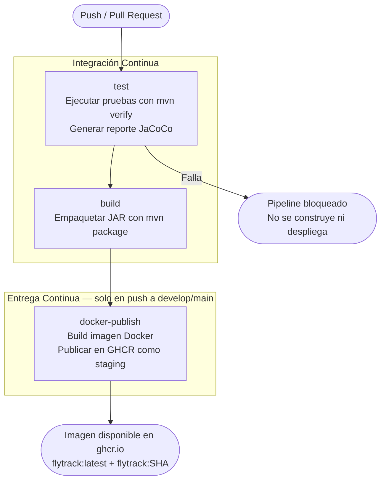

# Fase 2: Diseño del pipeline CI/CD — FlyTrack

## 1. ¿Qué es un pipeline CI/CD?

Un pipeline es una secuencia de pasos automáticos que se ejecutan cada vez que hay un cambio en el código. Garantiza que el software siempre pase por las mismas etapas de validación antes de llegar a producción.

- **CI (Integración Continua)**: cada cambio se integra, compila y prueba automáticamente.
- **CD (Entrega Continua)**: si las pruebas pasan, la aplicación se empaqueta y publica sin intervención manual.

## 2. Flujo del pipeline propuesto



## 3. Descripción de cada etapa

### Etapa 1 — test

**Disparador**: cualquier push o pull request hacia `develop` o `main`.

**Pasos**:
1. Checkout del código fuente.
2. Configurar Java 17 (Temurin) con caché de dependencias Maven.
3. Ejecutar `mvn verify`: compila, corre las 32 pruebas y genera reporte JaCoCo.
4. Publicar reporte Surefire (resultados de pruebas) como artefacto.
5. Publicar reporte JaCoCo (cobertura de código) como artefacto.

**Criterio de éxito**: todas las pruebas pasan. Si alguna falla, el pipeline se detiene aquí.

**Cobertura actual**: 87% de instrucciones, 100% de métodos públicos.

### Etapa 2 — build

**Disparador**: éxito de `test` (`needs: test`).

**Pasos**:
1. Checkout del código fuente.
2. Configurar Java 17 con caché Maven.
3. Ejecutar `mvn package -DskipTests -B` para generar el JAR ejecutable.
4. Publicar el JAR como artefacto descargable.

**Criterio de éxito**: JAR generado correctamente por Spring Boot Maven Plugin.

### Etapa 3 — docker-publish

**Disparador**: éxito de `build` + `github.event_name == 'push'` (no corre en PRs).

**Pasos**:
1. Checkout del código fuente.
2. Login en GitHub Container Registry con `GITHUB_TOKEN` (sin secretos adicionales).
3. Build de imagen Docker multi-stage desde `flytrack/Dockerfile`.
4. Push de dos tags: `latest` y el SHA del commit.

**Criterio de éxito**: imagen publicada en `ghcr.io/lyc4nthrope/flytrack`.

**Por qué no corre en PRs**: publicar una imagen desde una rama no integrada puede generar versiones incorrectas en el registro. Solo el código que llegó a `develop` o `main` (validado por revisión) merece existir como imagen de staging.

## 4. Diagrama de dependencias entre jobs

```
push/PR
   │
   ▼
[test] ──── falla ──▶ bloqueado
   │
   ▼ pasa
[build]
   │
   ▼ pasa + es push (no PR)
[docker-publish]
   │
   ▼
ghcr.io/lyc4nthrope/flytrack:latest
ghcr.io/lyc4nthrope/flytrack:<SHA>
```

## 5. ¿Dónde está staging?

En este laboratorio, **staging es el GitHub Container Registry (GHCR)**. Cada imagen publicada representa una versión validada y lista para despliegue. Cualquier entorno (VM, servidor, máquina local) puede descargar esa imagen con:

```bash
docker pull ghcr.io/lyc4nthrope/flytrack:latest
docker run -p 8080:8080 ghcr.io/lyc4nthrope/flytrack:latest
```

Esto garantiza que el entorno de ejecución es idéntico al que pasó por el pipeline, eliminando el problema de "en mi máquina funciona".

## 6. Comparación: flujo anterior vs flujo propuesto

| Aspecto | Antes | Con el pipeline |
|---------|-------|-----------------|
| Pruebas | Manuales o inexistentes | 32 pruebas automáticas en cada push |
| Calidad | Sin medición | JaCoCo reporta cobertura por cada build |
| Empaquetado | Manual, variable | JAR reproducible por Maven |
| Imagen Docker | Construida a mano localmente | Construida y publicada por Actions |
| Despliegue | SSH + pasos manuales | `docker pull` + `docker run` desde GHCR |
| Trazabilidad | Ninguna | Cada imagen lleva el SHA del commit |

## 7. Herramientas del pipeline y su rol

| Herramienta | Rol en el pipeline |
|-------------|-------------------|
| GitHub Actions | Orquestador del pipeline (motor CI/CD) |
| `actions/setup-java@v4` | Configura JDK 17 con caché de Maven |
| `mvn verify` | Compila + prueba + genera reporte de cobertura |
| `mvn package` | Genera JAR ejecutable (Spring Boot fat JAR) |
| `actions/upload-artifact@v4` | Publica reportes y JAR para descarga |
| `docker/login-action@v3` | Autenticación en GHCR con GITHUB_TOKEN |
| `docker/build-push-action@v5` | Build multi-stage + push al registro |
| GHCR (`ghcr.io`) | Registro de imágenes como entorno staging |
